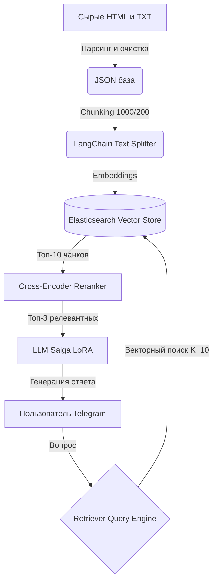

# ИИ-ассистент базы знаний ПЭК (RAG-система)


Интеллектуальный Telegram-бот для поиска информации по корпоративной базе знаний (выгрузки из Confluence). 

Система позволяет сотрудникам задавать вопросы на естественном языке и получать точные ответы, сгенерированные локальной большой языковой моделью (LLM), с обязательным цитированием источника — ссылкой на соответствующую внутреннюю статью.

## Бизнес-задача

Обеспечить оперативных сотрудников, аналитиков и разработчиков актуальной информацией о сложной гео-распределенной системе, включающей тысячи процессов и миллионы понятий.

**Ключевой функционал:**

- Загрузка, очистка и обработка "сырых" HTML-выгрузок статей и извлечение ссылок из TXT-файлов.
- Сопоставление текста запроса пользователя с загруженным содержимым.
- Отбор и цитирование наиболее подходящих абзацев из статей с предоставлением ссылки на оригинал.
- Динамическое пополнение базы знаний материалами в реальном времени, без остановки работы прикладной части.

## Архитектура решения (Advanced RAG)

Проект построен на базе архитектуры **Retrieval-Augmented Generation (RAG)** с использованием гибридного поиска и этапа реранжирования (Reranking) для максимизации релевантности ответов.



## Обоснование технических решений

1. **Векторная БД (Elasticsearch):** выбрана для обеспечения production-ready векторного (Dense Retrieval) и гибридного поиска. Позволяет динамически индексировать новые документы "на лету" без даунтайма системы.
2. **Chunking (Разбиение текста):** сырые корпоративные статьи слишком велики для контекстного окна эмбеддинг-моделей. Использован RecursiveCharacterTextSplitter с перекрытием (overlap), чтобы не терять семантические связи на стыках абзацев.
3. **Reranker (BAAI/bge-reranker-base):** классический косинусный поиск по эмбеддингам часто выдает "шум". Внедрение кросс-энкодера (Cross-Encoder) позволяет переранжировать топ-10 найденных документов и отдавать в LLM только 3 самых точных, что радикально снижает вероятность галлюцинаций модели.
4. **Локальная LLM (Saiga/Mistral):** использована локально развернутая модель семейства Сайга, адаптированная под русский язык (через PEFT/LoRA).

## Стек технологий

**Оркестрация RAG:** LlamaIndex, LangChain
**Embeddings:** sentence-transformers/distiluse-base-multilingual-cased-v2 (возможна замена на легковесные аналоги типа rubert-tiny2)
**Reranker:** BAAI/bge-reranker-base
**Генеративная LLM:** IlyaGusev/saiga_mistral_7b_lora (transformers, peft)
**Хранилище:** Elasticsearch 8.8+
**ETL и Парсинг:** BeautifulSoup4
**Интерфейс:** telebot.async_telebot (Асинхронный обработчик для параллельной работы с пользователями)

## Структура проекта

```text
pecom-knowledge-bot/
├── data/
│   ├── raw/                 # Исходные HTML-выгрузки и TXT-файлы со ссылками
│   └── processed/           # Очищенный и собранный ConfluencePages.json
├── src/
│   ├── __init__.py
│   ├── parser.py            # ETL: парсинг HTML, очистка тегов, маппинг ссылок
│   ├── indexer.py           # Чанкинг и батч-загрузка векторов в Elasticsearch (tqdm + CUDA/CPU)
│   ├── rag_pipeline.py      # Ядро NLP: инициализация LLM, промпты, ретривер и реранкер
│   └── bot.py               # Асинхронный Telegram-бот с пулом потоков
├── .env.example             # Шаблон файла конфигурации переменных окружения
├── requirements.txt         # Зависимости Python
└── README.md                # Документация проекта
```

## Установка и запуск 

1. **Подготовка окружения**    
Клонируйте репозиторий и установите необходимые зависимости:

```bash
git clone https://github.com/SabiaPI1/pecom-knowledge-bot.git
cd pecom-knowledge-bot

# Создание и активация виртуального окружения
python -m venv venv
# Для Windows:
venv\Scripts\activate
# Для Linux/Mac:
# source venv/bin/activate

# Установка библиотек
pip install -r requirements.txt
```

2. **Настройка переменных окружения**    
Создайте файл .env в корне проекта (или скопируйте из .env.example) и заполните его своими данными:

```env
TELEGRAM_BOT_TOKEN=ваш_токен_от_botfather
ELASTIC_HOST=https://localhost:9200
ELASTIC_USER=elastic
ELASTIC_PASSWORD=ваш_пароль_от_elasticsearch
```

3. **Подготовка данных и базы** 
Убедитесь, что локально или на сервере запущен Elasticsearch 8+.
Поместите сырые данные (папки с HTML и TXT-файлами) в директорию data/raw/.

**Шаг 3.1. Запустите парсер** для извлечения текстов и ссылок в единую JSON-базу:

```bash
python src/parser.py
```

**Шаг 3.2. Запустите индексатор** для разбиения текста на чанки, векторизации и загрузки в Elasticsearch:

```bash
python src/indexer.py
```

4. **Запуск Telegram-бота**   
Когда база знаний проиндексирована, можно запускать самого ассистента:

```bash
python src/bot.py
```